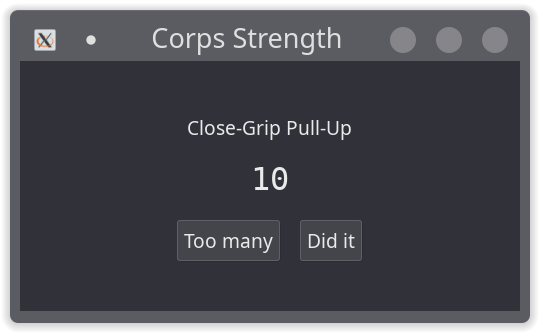

# Corps-Strength Workout Generator

Produces workout routines following the "mission" segment of [Corps Strength](https://www.goodreads.com/book/show/7623837-corps-strength).

You'd need to set up [Haskell](https://www.haskell.org/) and cabal in order to install it.

## CLI

```
Usage: corps-strength [(-k|--kettlebell) | (-d|--dumbbell)]
  Generate a corps strength mission.

Available options:
  -k,--kettlebell          use a kettlebell
  -d,--dumbbell            use a dumbbell
  -h,--help                Show this help text
```

### Build & Install

1. From the base dir of this repo: `$ cabal install corps-strength --installdir=$HOME/.local/bin/ --overwrite-policy=always`

## GUI



### Build & Install

1. Install pre-requisite libraries for [haskell-gi](https://github.com/haskell-gi/haskell-gi#installation)
2. From the base dir of this repo: `$ cabal install corps-strength-gui --installdir=$HOME/.local/bin/ --overwrite-policy=always`
